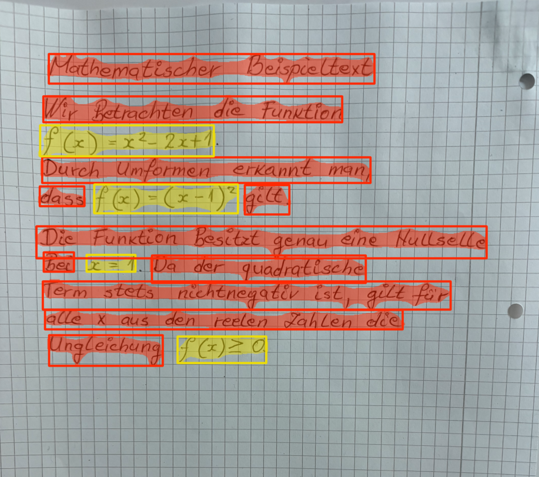

# HTR-Pipeline für deutschen handschriftlichen Text mit mathematischen Ausdrücken

> **Hinweis:** Dieses Projekt ist ein Bachelorprojekt und befindet sich noch in Entwicklung. Insbesondere liefert das YOLO-Segmentierungsmodell in bestimmten Fällen noch Fehler, was die Gesamtqualität der Erkennung beeinträchtigen kann.

Dieses Projekt implementiert eine modulare HTR-Pipeline (Handwritten Text Recognition), die YOLOv11-basierte Instanzsegmentierung mit zwei spezialisierten TrOCR-Modellen kombiniert, um deutsche handschriftliche Notizen zu digitalisieren – sowohl Fließtext als auch mathematische Ausdrücke.
Die Pipeline ist in eine lokale Webanwendung integriert, bestehend aus einem Angular-Frontend und einem FastAPI-Backend.

## Modelle
Das trainierte YOLO-Modell kann hier runtergeladen werden [Link zm YOLO Modell](https://huggingface.co/fhswf/yolov11_htr_seg)

Die fine-tuned TrOCR-Modelle können ebenfalls runtergeladen werden:
[Text-TrOCR](https://huggingface.co/fhswf/htr_ger_text_trocr)
[Math-TrOCR](https://huggingface.co/fhswf/htr_math_trocr)

Die Modelle können auch ausgetauscht werden, dazu kann hier das Verzeichnis angepasst werden:

```bash
model_path = hf_hub_download(repo_id="fhswf/yolov11_htr_seg", filename="weights/best.pt")
...
processor_text = TrOCRProcessor.from_pretrained("...")
model_text = VisionEncoderDecoderModel.from_pretrained("...").to(device)
```


## Postprocessing-Parameter:
Wichtige Postprocessing-Parameter, einschließlich Confidence-Threshold und IoU-Threshold für Non-Maximum Suppression (NMS) sowie weitere Parameter für nachgelagerte Verarbeitungsschritte, können direkt im Quellcode flexibel an deine Eingabedaten angepasst werden, Beispiel:
```bash
yolo.predict(img, conf=0.5, iou=0.7, agnostic_nms=True) # conf and iou can be changed 
```
Ein niedrigerer Confidence-Score kann zu mehr erkannten Objekten führen, erhöht jedoch auch die Wahrscheinlichkeit von Fehlklassifikationen.

## Zusätzlich:
Da ein YOLO-Segmentierungsmodell genutzt wird, kann flexibel zwischen Masken- und Boxen Verarbeitung gesteuert werden. Dies geschieht über die Funktion:
```bash
isolate_mask_in_box(img, det, show_mask=True) #show_mask=Flase (uses boxes instead of masks)
```
In der Praxis decken die Masken nicht immer die gesamte Instanz ab. In solchen Fällen sind die Bounding Boxen etwas robuster.

## Backend Setup
```bash
cd backend
py -3.10 -m venv venv # Create virtual environment
venv\Scripts\activate # Activate virtual environment
pip install -r requirements.txt # Install dependencies
python backend_abgabe.py # Start the backend
```
> **Python Version:** Die Pipeline wurde mit Python 3.9.21 und 3.10.11 getestet. Andere Versionen können zu Kompatibilitätsproblemen mit den benötigten Bibliotheken führen.

> **GPU:** Eine CUDA-fähige NVIDIA-GPU wird empfohlen, da die Pipeline große TrOCR-Modelle verwendet, die auf der CPU deutlich langsamer laufen können. Falls nötig, installiere die passende PyTorch-Version für deine GPU via [pytorch.org/get-started/locally](https://pytorch.org/get-started/locally/) und entferne anschließend die Zeile `torch` via `pip uninstall torch torchvision torchaudio -y` aus der `requirements.txt`.

## Frontend Setup
Erfordert [Node.js and npm](https://nodejs.org/).

```bash
ng serve # starts the angular frontend (local 4200) (command in htr_pipeline_web_project-Folder)
```


## Beispiele & Einschränkungen
Die Pipeline funktioniert am besten bei klar strukturierten Notizen mit gut getrennten Zeilen und eindeutig erkennbaren mathematischen Ausdrücken.
Mathematische Ausdrücke werden in LaTeX-Notation ausgegeben und können in der Webanwendung oder in jedem LaTeX-kompatiblen Editor dargestellt werden:



```
Mathematischer Beispieltext 
Wir Betrachten die Funktion
$f(x)=x^{2}-2x+1$
Durch Umformen erkannt man,
dass $f(x)=(x-1)^{2}$ gilt.
Die Funktion besitzt genau eine Hullselle.
Bei $x=1$ Da der quadratische
Term stets nichtnegativ ist, gilt für 
alle x aus den reelen Zahlen die 
Ungleichung $f(x)\geq0.$ 
```

Dicht geschriebene oder überlappende Zeilen können zu Segmentierungsfehlern führen, was sich negativ auf die Gesamtqualität der Erkennung auswirkt!

## PDF-Server Setup (optional)
Falls ein Export der Ergebnisse als PDF durchgeführt werden möchte:
```bash
cd pdf-server
node server.js
```

English:

# HTR-Pipeline for German Handwritten Text with Mathematical Expressions

> **Note:** This project is a university project and still a work in progress. In particular, the YOLO segmentation model still produces errors in certain cases, which can affect the overall recognition quality.

This project implements a modular HTR (Handwritten Text Recognition) pipeline that combines YOLOv11-based instance segmentation with two specialized TrOCR models to digitize German handwritten notes containing both plain text and mathematical expressions. The pipeline is integrated into a local web application with an Angular frontend and a FastAPI backend.

## Models
The trained YOLO model can be downloaded here: [Link to YOLO-Model](https://huggingface.co/fhswf/yolov11_htr_seg)

The fine-tuned TrOCR models can also be downloaded:
[Text-TrOCR](https://huggingface.co/fhswf/htr_ger_text_trocr)
[Math-TrOCR](https://huggingface.co/fhswf/htr_math_trocr)

The models can also be replaced by adjusting the paths here:

```bash
model_path = hf_hub_download(repo_id="fhswf/yolov11_htr_seg", filename="weights/best.pt")
...
processor_text = TrOCRProcessor.from_pretrained("...")
model_text = VisionEncoderDecoderModel.from_pretrained("...").to(device)
```

Place the model folders in the `backend` directory before starting the application.

## Postprocessing Parameters
Key postprocessing parameters, including confidence threshold and IoU threshold for Non-Maximum Suppression (NMS) as well as parameters for other postprocessing steps, can be freely adjusted directly in the source code to suit your input data:
```bash
yolo.predict(img, conf=0.5, iou=0.7, agnostic_nms=True) # conf and iou can be changed
```

## Additionally:
Since a YOLO segmentation model is used, it is possible to switch between mask-based and bounding box-based processing via:
```bash
isolate_mask_in_box(img, det, show_mask=True) #show_mask=Flase (uses boxes instead of masks)
```
In practice, masks may not fully cover an instance. In such cases, bounding boxes are often more robust.


## Backend Setup
```bash
cd backend
py -3.10 -m venv venv # Create virtual environment
venv\Scripts\activate # Activate virtual environment
pip install -r requirements.txt # Install dependencies
python backend.py # Start the backend
```

> **Python Version:** The pipeline has been tested with Python 3.9.21 and 3.10.11. Other versions may cause compatibility issues with the required libraries.

> **GPU:** A CUDA-capable NVIDIA GPU is recommended, as the pipeline uses large TrOCR models that can be slow to run on CPU. If needed, install the matching PyTorch version for your GPU via [pytorch.org/get-started/locally](https://pytorch.org/get-started/locally/) and remove the `torch` via `pip uninstall torch torchvision torchaudio -y` line from `requirements.txt` afterwards to prevent it from being overwritten.

## Frontend Setup

Requires [Node.js and npm](https://nodejs.org/).
```bash
npm install
ng serve
```

## Examples & Limitations

The pipeline works best on clearly structured notes with well-separated lines and distinct mathematical expressions. Mathematical expressions are output in LaTeX notation and can be rendered in the web application or any LaTeX-compatible editor:


```
Mathematischer Beispieltext 
Wir Betrachten die Funktion
$f(x)=x^{2}-2x+1$
Durch Umformen erkannt man,
dass $f(x)=(x-1)^{2}$ gilt.
Die Funktion besitzt genau eine Hullselle.
Bei $x=1$ Da der quadratische
Term stets nichtnegativ ist, gilt für 
alle x aus den reelen Zahlen die 
Ungleichung $f(x)\geq0.$ 
```

Note that densely written or overlapping lines can lead to segmentation errors, which may affect the overall recognition quality.

## Angular - Further Information

This project was generated with [Angular CLI](https://github.com/angular/angular-cli) version 18.2.9.

## Development server

Run `ng serve` for a dev server. Navigate to `http://localhost:4200/`. The application will automatically reload if you change any of the source files.

## Code scaffolding

Run `ng generate component component-name` to generate a new component. You can also use `ng generate directive|pipe|service|class|guard|interface|enum|module`.

## Build

Run `ng build` to build the project. The build artifacts will be stored in the `dist/` directory.

## Running unit tests

Run `ng test` to execute the unit tests via [Karma](https://karma-runner.github.io).

## Running end-to-end tests

Run `ng e2e` to execute the end-to-end tests via a platform of your choice. To use this command, you need to first add a package that implements end-to-end testing capabilities.

## Further help

To get more help on the Angular CLI use `ng help` or go check out the [Angular CLI Overview and Command Reference](https://angular.dev/tools/cli) page.


